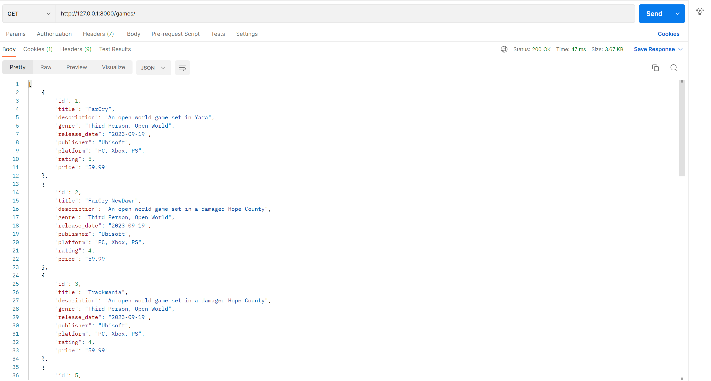
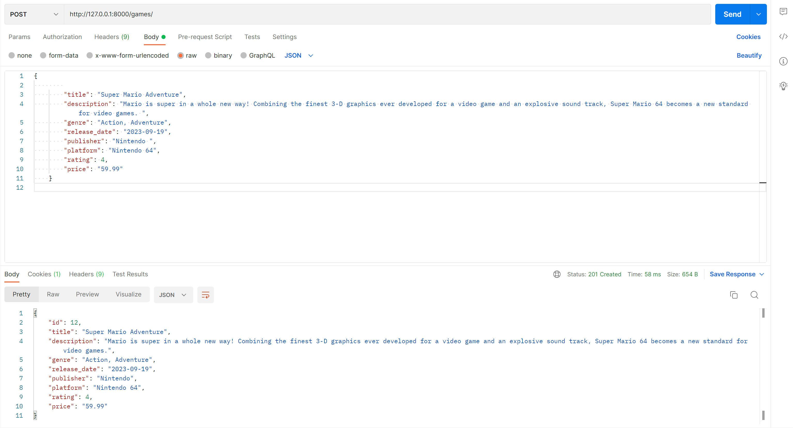
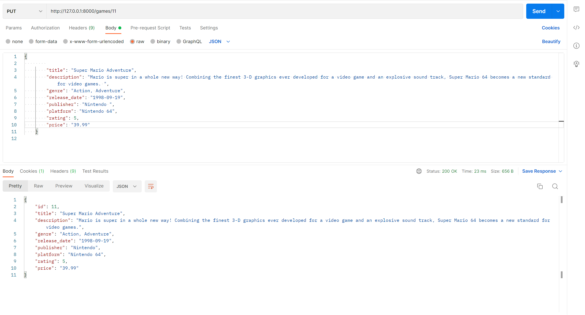
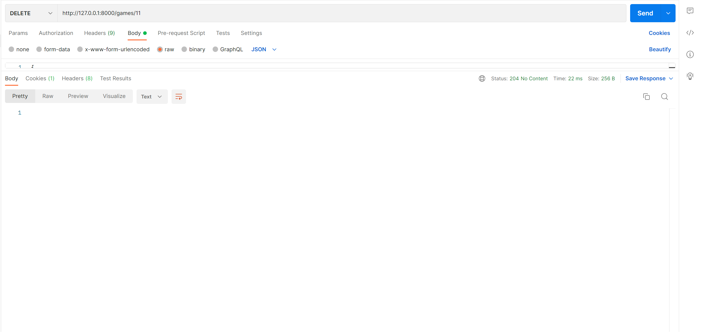
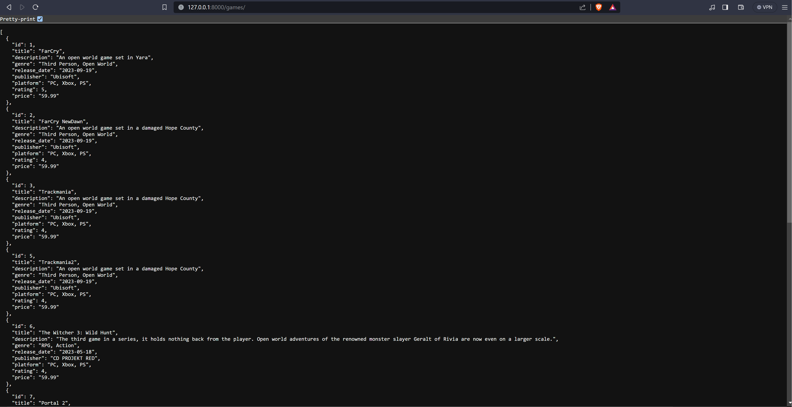

# Games-Directory-API
This is a simple API that lists games stored on a DB. It performs CRUD operations as highlighted below. 

# Setting up
## Clone the repository
- 'git clone https://github.com/Tonny-Kioko/Games-Directory-API.git'

## Install requirements
- Ensure you at the root directory and run 'pip install -r requirements.txt'
- Incase the database file is missing after cloning, please find it attached within the submission. Paste it onto the project's root directory. 

# Testing the API
## Starting the server
- Run 'python manage.py runserver'.
- Open your browser and paste the address 'http://127.0.0.1:8000/games/' to get a list of all items stored in the database.

## Making simple requests
- We will make requests/test the API using Postman. Start the app and create a new collection and select new request. 

1. Retrieve a list of all resources
- To get all teh items stored on the database, select the 'GET' option and enter the URL 'http://127.0.0.1:8000/games/'

2. Create a new resource
- To create a new resource, select the 'POST' option and enter the URL 'http://127.0.0.1:8000/games/'
- Under 'body', select 'raw' and on the dropdown, select 'JSON'.
- Enter the new record in JSON format and run

3. Retrieve a specific resource by ID
- To retrieve specific records, select the 'GET' option and enter the URL 'http://127.0.0.1:8000/games/1/' with the game ID to retrieve.

4. Update a specific resource by ID
- To update a specific record, select the 'PUT' option and enter the URL 'http://127.0.0.1:8000/games/1/0' with the game ID.
- On the body, enter the updates to the record and run. They will be saved to the specific record. 

5. Delete a specific resource by ID
- To delete a specific record, select the 'DELETE' option and enter the URL 'http://127.0.0.1:8000/games/1/' with the game ID.
- Run the request and its results will be saved on the database. 

## Running the READ operation (GET)

## Run the CREATE operation (POST)

## Run the UPDATE operation (PUT)

## Run the DELETE operation (DELETE)

## A list of all available games on the database
